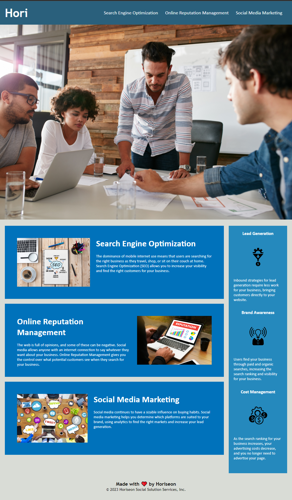

# Challenge 1 for Bootcamp!

## Description

- We wanted to optimize our webpage with things like semantic html elements, alt attributes on images and a concise title.
- We wanted our webpage be not only accessable, but easy to find with a search engine and approachable enough to warrent a visit from potential clients.
- The issue we had was messy code with unlabeled divs, inaccessable images to those with disabilities, and a lack of description in title. All of which has been revised and fixed!
- I learned alot about organization, image tagging and a little css revision! I enjoyed beig able to tinker with different solutions on my own and seeing how they effected the page as a whole.

## Screenshot

## Link

https://firefoxflareon.github.io/Challenge1/

